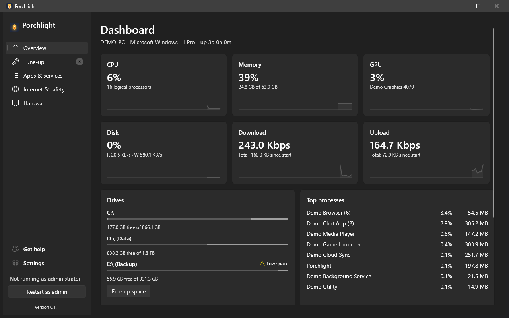
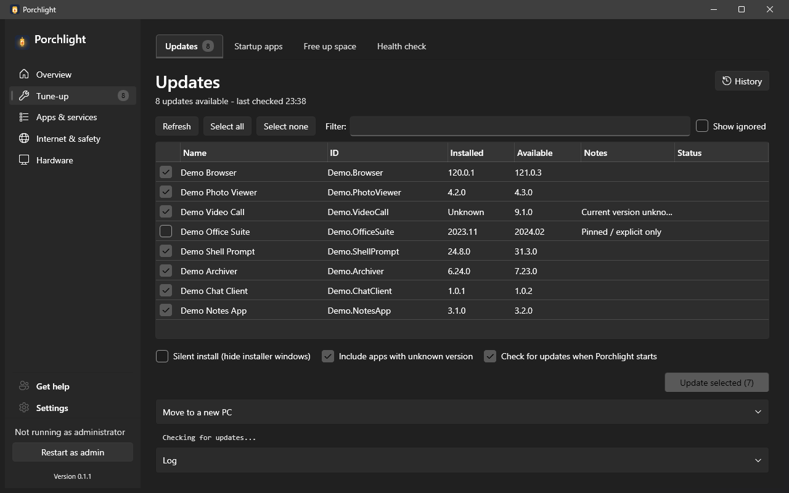
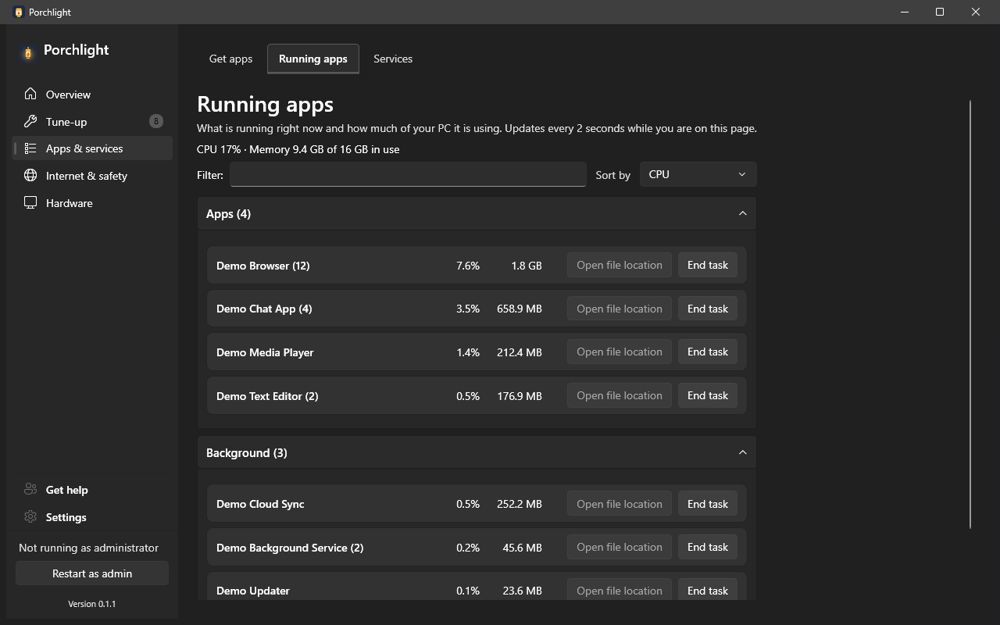
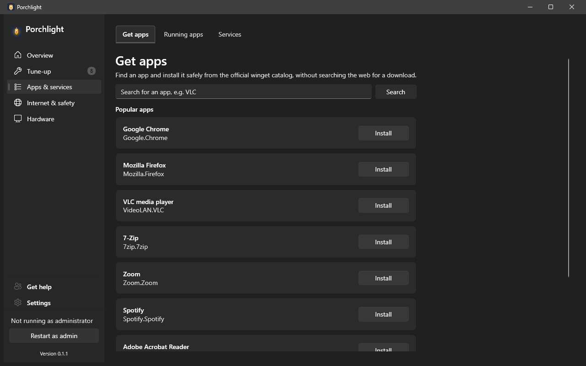
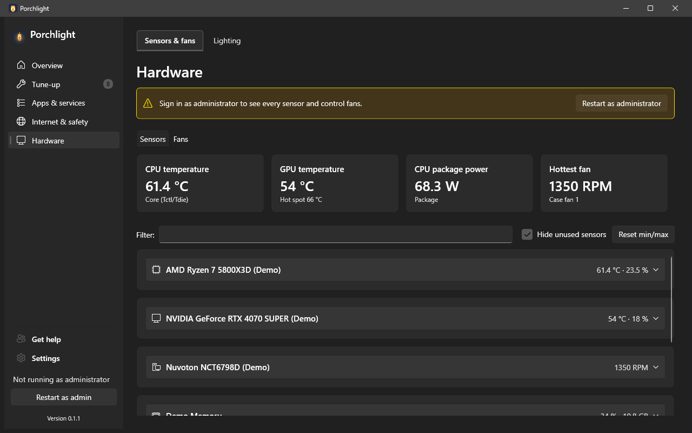

<picture>
  <source media="(prefers-color-scheme: dark)" srcset="assets/brand/porchlight-logo-dark.png">
  
</picture>

Porchlight is for the family member who ends up as tech support for a parent's or grandparent's PC
from a distance. It sits quietly on their computer, shows what's going on in plain language, and
makes it easy to check in, help out, and offer remote support when something needs a closer look -
so you can help before a small problem turns into a phone call.

Built with C# / .NET (WPF). Windows only.

## A quick tour

Screenshots use made-up demo data, not a real PC.

**Dashboard** - how is the PC doing right now?

**Tune-up > Updates** - tick the programs to update and Porchlight does the rest.

**Apps & services > Running apps** - what's slowing it down right now?

**Apps & services > Get apps** - install a program safely, without hunting for a download page.

**Hardware > Sensors & fans** - is it running hot?

**Get help** - let family connect in two clicks (uses AnyDesk).

## Pages

Each link opens a guide that explains everything on that page.

**Overview**
- [Dashboard](docs/pages/dashboard.md) - live stats, drive space, busiest programs.

**Tune-up**
- [Updates](docs/pages/updates.md) - see and install program updates, and look back at what was updated.
- [Startup apps](docs/pages/startup-apps.md) - see what slows down sign-in and choose what starts with Windows.
- [Free up space](docs/pages/free-up-space.md) - clear leftovers and find what fills a drive.
- [Health check](docs/pages/health-check.md) - disk and battery health, Windows repair, recent problems.

**Apps & services**
- [Get apps](docs/pages/get-apps.md) - search for a program and install it from the official catalog.
- [Running apps](docs/pages/running-apps.md) - what's running, how much it uses, and close a stuck program.
- [Services](docs/pages/services.md) - background helpers that other programs installed; stop or turn off the ones you don't need.

**Internet & safety**
- [Internet](docs/pages/internet.md) - connection details, "fix my internet", speed test.
- [Browser add-ons](docs/pages/browser-add-ons.md) - flag add-ons worth a second look.

**Hardware**
- [Hardware](docs/pages/hardware.md) ("Sensors & fans" tab) - temperatures, speeds, power, optional fan control.
- [Lighting](docs/pages/lighting.md) - colours, effects and profiles for RGB lights.

**Get help**
- [Get help](docs/pages/get-help.md) - let family connect, and send them a check-up.
- [Web console](docs/pages/web-console.md) - watch this PC's stats from a phone (read-only).

**Settings** (pinned at the bottom of the left menu, below Get help)
- [Settings](docs/pages/settings.md) - three tabs: General (theme, start at sign-in, tray), Notifications (alerts, update checks) and Optional features (AnyDesk, OpenRGB, PawnIO driver).

For a technical list of everything Porchlight does, see [docs/FEATURES.md](docs/FEATURES.md).

## Install

Download `Porchlight-Setup-<version>.exe` from the [Releases](https://github.com/El1rans/porchlight/releases) page and run it.

- The installer is unsigned for now, so Windows SmartScreen will warn about it. Click **More info**, then **Run anyway**. See the [code signing policy](docs/CODE_SIGNING_POLICY.md).
- Setup can also install optional helpers with `winget`: AnyDesk (remote help), OpenRGB (RGB lighting) and the PawnIO driver (fan control and sensors). You can add them later from Settings > Optional features.
- Installed copies update themselves from inside the app (Tune-up > Updates) - see [docs/specs/23-self-update.md](docs/specs/23-self-update.md).

More detail (silent install, uninstalling, upgrading from PC Manager): [docs/INSTALL.md](docs/INSTALL.md).

## More

- [Building and contributing](CONTRIBUTING.md) - build, test and pull request workflow.
- [Privacy statement](docs/CODE_SIGNING_POLICY.md#privacy-statement) - what Porchlight contacts over the network.
- [Roadmap](docs/ROADMAP.md) - what might come next.
- [Security](SECURITY.md) - how to report a vulnerability.

## License

MIT - see [LICENSE](LICENSE).

Free code signing provided by [SignPath.io](https://signpath.io), certificate by
[SignPath Foundation](https://signpath.org).
