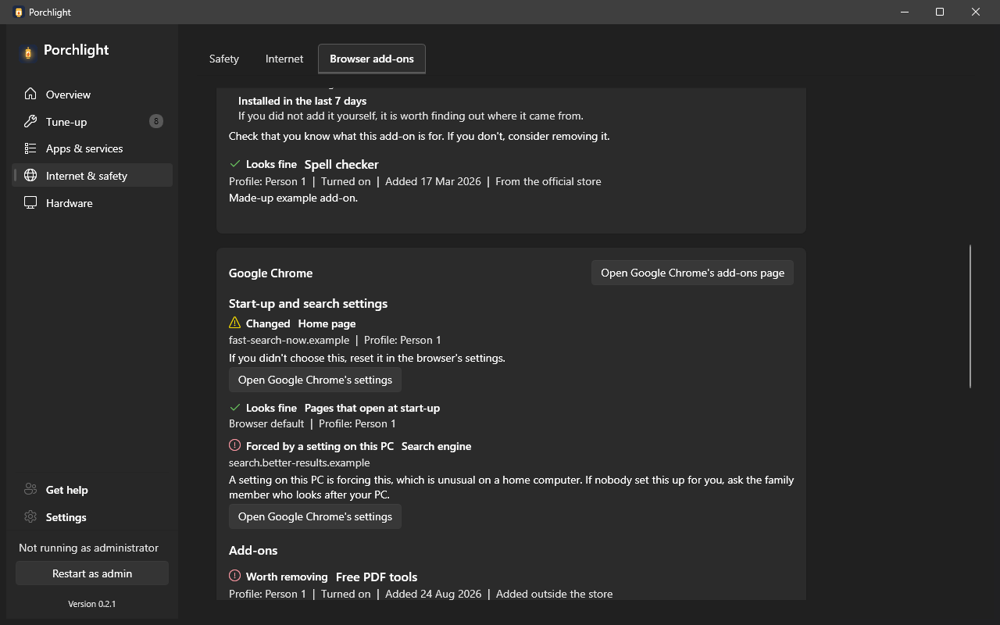

# Browser add-ons

**Where to find it:** Internet & safety > Browser add-ons.

Lists the add-ons (extensions) installed in the web browsers on this PC and flags the ones worth a second look. Unwanted add-ons can slow a browser down or watch what you do online. **Porchlight only looks: it never changes, turns off or removes anything in your browsers.**

## What's on the page

- **Summary line** - how many add-ons were found and how many are worth reviewing.
- **Refresh** - reads the browsers again.
- **Show only add-ons to review** - hides the ones that look fine.
- **One card per browser** - with an **Open ... add-ons page** button that opens that browser's own add-ons screen (where you remove things), and a note if the browser has none.

## Start-up and search settings

Unwanted programs often take over a browser's home page or search engine so that every search goes
through their own site. At the top of each browser's card, **Start-up and search settings** checks the
**home page**, the **pages that open at start-up**, the **new-tab page** (where it can be set outside an
add-on) and the **search engine** in every profile of Chrome, Edge, Brave and Firefox.

*(Screenshot uses made-up demo data, not a real PC.)*

Each one is marked, with an icon and words:

- **Looks fine** - empty (the browser's default) or a well-known provider such as Google, Bing,
  DuckDuckGo, Yahoo or the browser's own page.
- **Changed** - something else. It shows the website's name, and "If you didn't choose this, reset it in
  the browser's settings." **Open ... settings** opens that browser's own settings page.
- **Forced by a setting on this PC** - a browser policy in Windows points somewhere unfamiliar. That is
  unusual on a home computer, so the page says: "If nobody set this up for you, ask the family member
  who looks after your PC."

"Changed" is a reason to look, not proof of anything bad. Everything is read on this PC; nothing is
looked up online and nothing is changed. Firefox's own policy files are not read.

## Each add-on

- **Name** and a short **description**.
- **Details** - which browser profile it is in, whether it is turned on or off, when it was added, and where it came from (for example the browser's official store).
- **A verdict** with an icon: **Looks fine**, **Review** ("check that you know what this add-on is for") or **Worth removing** ("if you don't recognise it, remove it").
- **Reasons** - the specific things that raised the flag, in plain words.

## How to remove an add-on

A short numbered guide at the bottom: click the "Open ... add-ons page" button next to your browser, find the add-on in the list, and click Remove.

---

[Back to the page list](../../README.md#pages)
