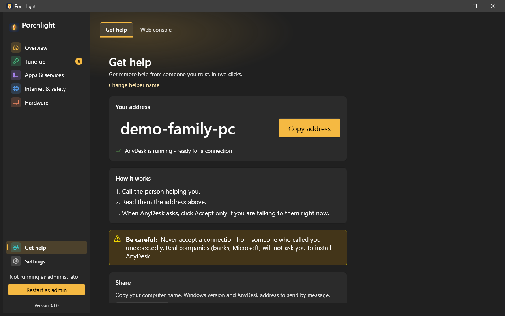

# Get help

**Where to find it:** Get help (pinned at the bottom of the left menu). It has two tabs: **Get help** and [Web console](web-console.md).

Lets someone you trust connect to this PC to help, in two clicks. It uses **AnyDesk**, a remote-help program; Porchlight installs it if you choose (see [Settings > Optional features](settings.md#optional-features)), reads its address, and starts it. Porchlight never changes AnyDesk's security settings.

*(Screenshot uses a made-up demo address, not a real one.)*

## Top of the page

- **Helper line and Change helper name** - the name of the person who usually helps you, used in the check-up card below. **Change helper name** opens a small box to set it.
- **AnyDesk not installed card** - if AnyDesk is missing, a card offers to install it, with a link to download it yourself.

## Your address

- **Address** - the big number or name you read out to the person helping.
- **Copy address** - copies it (a "Copied" note confirms).
- **Status** - whether AnyDesk is running and ready for a connection, with a **Start AnyDesk** button if it is not.
- **Trouble getting the address** - a message and a **Try again** button if AnyDesk's address could not be read.

## How it works

Three steps: call the person helping you, read them the address, and click Accept in AnyDesk only if you are talking to them right now.

## Be careful

A warning: never accept a connection from someone who called you unexpectedly. Real companies (banks, Microsoft) will not ask you to install AnyDesk.

## Share

**Copy support info** copies the computer name, Windows version and AnyDesk address so you can send them in a message.

## Send a check-up to your helper

Creates a short summary of how the PC is doing. You see all of it before anything is sent, and it never includes your name, files or apps.

- **Your helper's email (optional)**, then **Create check-up**.
- A preview of the report, with **Copy report**, **Save report...** and **Email it** (opens your email program with the report ready to send; Porchlight does not send anything itself).
- A status message about what just happened.

---

[Back to the page list](../../README.md#pages)
