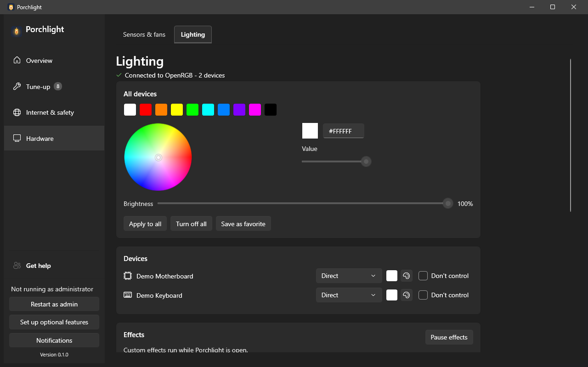

# Lighting

**Where to find it:** Hardware > Lighting.

Controls the RGB lights in the PC (motherboard, memory, graphics card, keyboard and so on) from one place. It works through the optional **OpenRGB** component, which Porchlight can install for you (see [Set up optional features](set-up-optional-features.md)). Without OpenRGB the page shows a card offering to install it.

*(Screenshot uses made-up demo data, not a real PC.)*

## Top of the page

- **Connection line** - whether Porchlight is connected to OpenRGB and how many devices it found, plus the result of your last action.
- **Other software may also control this lighting** (yellow banner, **Dismiss** to hide it) - lists vendor programs that are running and could fight Porchlight over the lights (for example Logitech G HUB or ASUS Armoury Crate), each with a button to deal with it.
- **Start OpenRGB with Porchlight** - starts OpenRGB automatically when Porchlight opens.
- **Retry connection** - rechecks whether OpenRGB is installed and running.

## All devices

Set every light at once.

- **Colour swatches** - one click picks a common colour.
- **Colour wheel, hex box and Value slider** - pick any colour exactly.
- **Brightness** slider.
- **Apply to all**, **Turn off all**, and **Save as favorite** (keeps the current colour as a swatch you can reuse; remove a favorite with its x button).

## Devices

One row per RGB device: its name, an **effect / mode picker** (for example "Direct" for a plain colour, or one of the built-in effects), a colour button to set that device to the colour above, a small palette button that opens a colour picker for just that device (**Close** to dismiss), and **Don't control** - leaves that device to its own vendor software instead of Porchlight/OpenRGB.

## Effects

Custom effects run while Porchlight is open.

- **Pause effects / Resume effects** - stops or restarts every device's custom effect.
- **Updates alert overlay** - pulses a warning colour over each device's effect while app updates are waiting.
- **Per device:** the device name, an effect, **Speed**, temperature-reactive **Min °C** and **Max °C** ranges where the effect uses them, and an **Animation** picker for custom animations.

## Custom animations

Make your own animation with AI: **Copy AI prompt**, paste it into an AI chat (ChatGPT, Claude, Gemini...), describe what you want, copy its answer, then **Paste from clipboard**. **Import animation file...** loads a Porchlight animation (.json) file instead. Imported animations are listed with a **Remove** button.

## Profiles

Saved lighting setups, each with a **Load** button (and remove).

---

[Back to the page list](../../README.md#pages)
