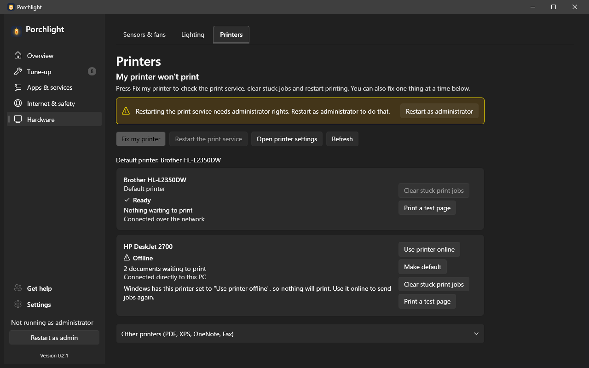

# Printers

**Where to find it:** Hardware > Printers.

"My printer won't print." The usual causes are a printer Windows has set to offline, a stuck job in the
queue, or a print service that has hung. This page shows each printer's state in plain words and fixes
those three things.

*(Screenshot uses made-up demo data, not a real PC.)*

## At the top

- **Fix my printer** - a guided repair. After asking first, Porchlight checks the print service,
  cancels what is waiting for the chosen printer and restarts printing, then lists **What Porchlight
  did**. You can also fix one thing at a time below.
- **Restart the print service** - restarts Windows' printing for everyone. It needs administrator
  rights: the button is greyed out and a banner offers **Restart as administrator** when Porchlight is
  not running as administrator.
- **Open printer settings** - opens Windows' own Printers page.
- **Refresh** - the page also reads the printers each time you open it.
- **Default printer** - which printer Windows uses unless told otherwise.

## Each printer

- **Name**, a **Default printer** tag, and its state with an icon and words: **Ready**, **Printing**,
  **Offline**, **Out of paper**, **Paper jam**, **Paused** or **Error**.
- How many documents are waiting, and whether it is connected over the network or directly to this PC.
- **Make default**, **Clear stuck print jobs** (asks first; documents waiting are cancelled) and
  **Print a test page**.
- For an offline printer, a short explanation and **Use printer online**. If Windows won't let
  Porchlight change it, the page opens the printer settings and tells you which option to turn off.

**Other printers (PDF, XPS, OneNote, Fax)** is a collapsed group for the built-in virtual printers.

Porchlight doesn't install, remove or rename printers or drivers.

---

[Back to the page list](../../README.md#pages)
