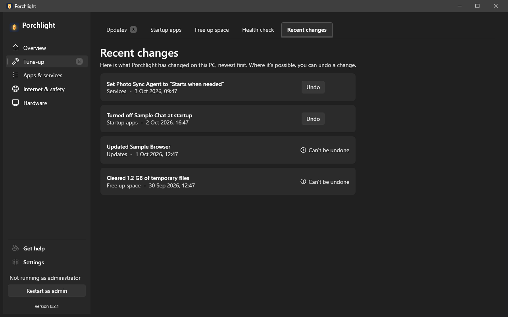

# Recent changes

**Where to find it:** Tune-up > Recent changes.

A plain list of what Porchlight has changed on this PC, newest first, so you can see what happened and,
where it is possible, put it back.

*(Screenshot uses made-up demo data, not a real PC.)*

## What's on the page

Each row is one change, in a sentence, with the area it belongs to and when it happened:

- **Startup apps** - an item turned off or on.
- **Services** - a service started, stopped, restarted or given a new start option.
- **Free up space** - a cleanup, with how much it cleared.
- **Apps** - a program installed from [Get apps](get-apps.md) or removed with [Remove apps](remove-apps.md).
- **Updates** - a program updated or reinstalled.

On the right of each row you will see one of:

- **Undo** - reverses the change. Porchlight tells you in plain words whether it worked or what to do
  next. Only startup items and services can be undone.
- **Can't be undone** - cleanups, installs, updates and removals can't be reversed from here.
- **Undone** - you already undid it.

When nothing has changed yet, the page says so.

## Restore point before big changes

Before it updates several apps at once or changes a service's start option, Porchlight asks Windows for
a restore point, so Windows can go back if something goes wrong. It only does this when System
Protection is on and Windows' own limit of one every 24 hours allows it, and it never stops your change
if it can't. You can turn it off in [Settings > General](settings.md#general).

---

[Back to the page list](../../README.md#pages)
