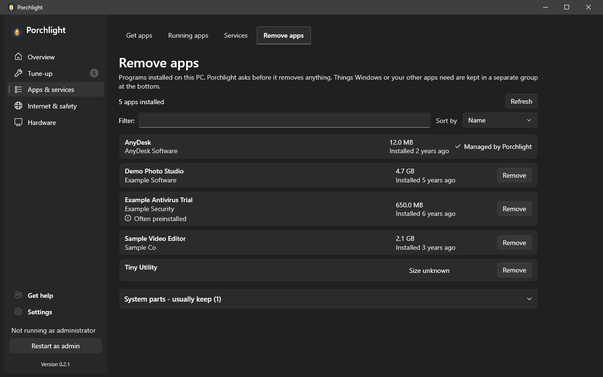

# Remove apps

**Where to find it:** Apps & services > Remove apps.

Windows' own list of installed apps is long and gives no hint about what is safe to remove. This page
shows the programs installed on this PC in a plain list and removes the ones you choose, carefully.

*(Screenshot uses made-up demo data, not a real PC.)*

## What's on the page

- **Summary line and Refresh** - how many apps are installed. Press **Refresh** after a program's own
  uninstaller finishes.
- **Filter** - type part of a name or publisher to narrow the list.
- **Sort by** - **Name** (the default), **Size** (largest first) or **Date** (newest first).

## Each app

- **Name** and **publisher**.
- **Size** and **how long ago it was installed**, when the program reported them ("Size unknown"
  otherwise).
- **Often preinstalled** - a hint on programs that commonly come with a new PC, such as trial
  antivirus, game bundles and maker's helper tools. It only means you may not have chosen it; it
  never says the program is bad.
- **Remove** - asks first ("Remove <name>? This can't be undone from Porchlight."). Porchlight then
  removes it quietly through `winget` when winget knows the program, and shows the result in plain
  words. Otherwise it starts the program's own uninstaller, which opens its own window for you to
  click through; press **Refresh** when it is done.

## Groups

- **System parts - usually keep** - a collapsed group at the bottom with runtimes and drivers that
  Windows and other programs need. Remove works there too, but think twice.
- **Managed by Porchlight** - AnyDesk, OpenRGB and the PawnIO driver have no Remove button here; use
  [Settings > Optional features](settings.md#optional-features). Porchlight itself is never listed.

Every removal is written to [Recent changes](recent-changes.md) as "Can't be undone". Microsoft Store
apps are not listed here.

---

[Back to the page list](../../README.md#pages)
