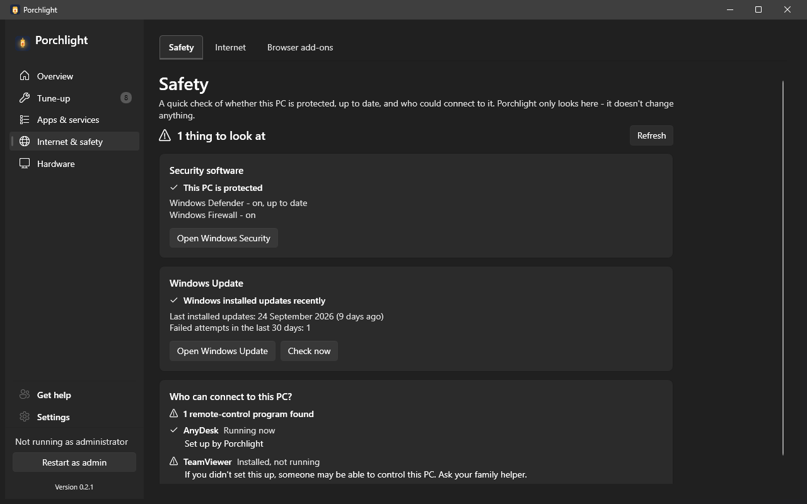

# Safety

**Where to find it:** Internet & safety > Safety.

A quick, calm answer to "is this PC safe?". The page checks three things and says what it found in
plain words. **Porchlight only looks here: it never changes a security setting, starts a scan, installs
an update or removes a program.**

*(Screenshot uses made-up demo data, not a real PC.)*

## What's on the page

- **Headline and Refresh** - one line such as "This PC looks safe" or "1 thing to look at", with an icon and words (never just a
  colour). **Refresh** checks again. The page also checks each time you open it, and each card appears
  as soon as it is ready.

### Security software

Shows whether the antivirus and the Windows Firewall are on and up to date, as one verdict:

- **This PC is protected** - antivirus is on with current definitions, and the firewall is on.
- **Antivirus is off**, **Antivirus is out of date** or **Windows Firewall is off** - the first
  problem found is the one shown.
- **Couldn't check** - Windows would not say.

Underneath is one line for each product, such as "Windows Defender - on, up to date" and
"Windows Firewall - on". If another antivirus is installed, Windows turns Defender off on purpose;
one that is on and current is enough. **Open Windows Security** opens Windows' own screen, where you
change anything.

### Windows Update

- When Windows last installed updates, and how many attempts failed in the last 30 days.
- A note if the PC is waiting for a restart to finish installing updates.
- **Open Windows Update** opens Windows' own page.
- **Check now** counts the updates that are waiting. It can take a few minutes, so it only runs when you
  press it, and it gives up politely if Windows takes too long.

The card flags a worry when three or more attempts failed recently, or nothing has been installed for
about two months. (Program updates, such as for your browser, are on the [Updates](updates.md) page.)

### Who can connect to this PC?

Lists remote-control programs that are installed or running, for example TeamViewer, AnyDesk, RustDesk,
UltraViewer, Splashtop, Chrome Remote Desktop, LogMeIn, ConnectWise ScreenConnect, Supremo and Quick
Assist.

- The AnyDesk that Porchlight set up for [Get help](get-help.md) is marked **Set up by Porchlight**.
- Anything else gets a warning: "If you didn't set this up, someone may be able to control this PC. Ask
  your family helper." Remote-control programs are a common part of phone scams, so a program nobody
  remembers installing is worth a conversation. Porchlight does not remove them; ask your helper, or use
  [Remove apps](remove-apps.md).

---

[Back to the page list](../../README.md#pages)
