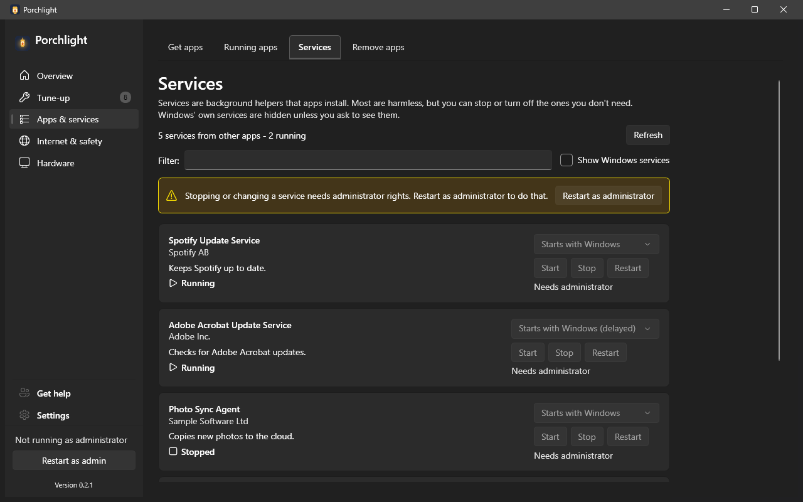

# Services

**Where to find it:** Apps & services > Services.

Many programs install a *service* - a helper that runs in the background all the time, for example
to check for updates or sync files. This page explains each one in plain words and lets you stop or
turn off the ones that came with other programs, without letting you break Windows.

*(Screenshot uses made-up demo data, not a real PC.)*

## What's on the page

- **Summary line and Refresh** - how many services from other apps there are and how many are running.
- **Filter** - search by name, publisher or description.
- **Show Windows services** - also lists Windows' own services. They are shown for information only
  and can't be changed here.
- **Administrator banner** - changing a service needs administrator rights. When Porchlight isn't
  running as administrator, the buttons are greyed out and the banner offers **Restart as administrator**.

## Each service

- **Name**, **publisher** and a one-line **description**.
- **Status** - Running, Stopped, Starting... or Stopping..., shown with an icon and a word.
- **Start option** - when the service starts:
  - **Starts with Windows** - every time the PC starts.
  - **Starts with Windows (delayed)** - a little after the PC has finished starting, so sign-in is not
    slowed down. Choosing plain **Starts with Windows** switches the delay off.
  - **Starts when needed** - only when a program asks for it.
  - **Turned off** - never.
- **Start**, **Stop** and **Restart** buttons.

Stopping a service or turning it off asks first, because the program that installed it may not work
properly until you turn it back on. Changes are written to [Recent changes](recent-changes.md), where
a start or stop can be undone, and Porchlight asks Windows for a restore point before it changes a
start option (see [Settings](settings.md#general)). A service that other services depend on can't be stopped here;
the page names the services that need it.

---

[Back to the page list](../../README.md#pages)
