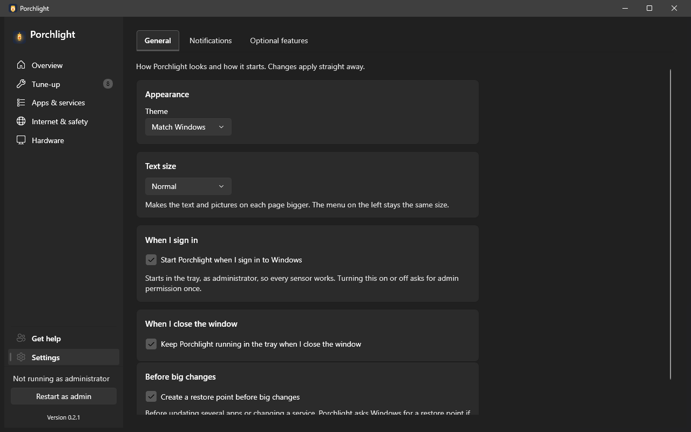

# Settings

**Where to find it:** Settings, pinned at the bottom of the left menu (below Get help). It has three tabs: **General**, **Notifications** and **Optional features**. Every change is saved straight away; there is no Save button.

## General

- **Appearance > Theme** - **Match Windows** (the default), **Light** or **Dark**. The change applies to every open window at once.
- **Text size** - **Normal** (the default), **Large** or **Extra large**. It makes the text and pictures on each page bigger straight away; the menu on the left and the tabs above the page stay the same size. At the largest size a few wide items (such as the remote-help address on [Get help](get-help.md)) may be trimmed.

  

  *(Screenshot uses made-up demo data.)*
- **When I sign in** - **Start Porchlight when I sign in to Windows**. Porchlight then starts in the tray, as administrator, so every sensor works from the first minute. Turning this on or off asks for administrator permission once. The box shows the real state each time you open the tab.
- **When I close the window** - **Keep Porchlight running in the tray when I close the window**. With this ticked, closing the window just hides Porchlight so it can keep watching and alerting.
- **Before big changes** - **Create a restore point before big changes** (on by default). Before updating several apps or changing a service's start option, Porchlight asks Windows for a restore point if System Protection is on, so Windows can go back if something goes wrong. If Windows says no, the change still goes ahead. See [Recent changes](recent-changes.md).

## Notifications

Porchlight can stay in the corner of your screen (the system tray) and tell you when something needs attention. It never installs anything by itself. The tray menu's **Notifications settings** opens this tab.

- **Tell me when** - tick the alerts you want:
  - **A drive is almost full**
  - **My PC is running too hot** (needs Porchlight to run as administrator with the PawnIO hardware driver installed)
  - **App updates are ready**
  - **My PC has needed a restart for a few days**

  Each message is shown at most once a day.
- **Check-up reminder** - tick **Remind me to send a check-up report** (off by default), then choose **Every week**, **Every 2 weeks** or **Every month** and the day of the week. While Porchlight is running (the window or the tray), it shows one reminder, "Time for a check-up", when one is due; clicking it opens the check-up on [Get help](get-help.md). If you made a report recently, it waits. If the PC was off on the day, you get one reminder the next time Porchlight runs. Porchlight never sends the report itself.
- **Check for app updates** - how often Porchlight looks for updates in the background: **Every day**, **Every week** or **Never**. It only looks; you choose when to install (on the [Updates](updates.md) page).

## Optional features

Porchlight works on its own, but three tools add extra abilities. This tab installs them for you, using Windows' `winget` tool, so an internet connection is needed. Installing needs administrator rights, and if `winget` is missing Porchlight tells you so.

- **One card per tool**, each with what it is for, its current status and a button (**Install**, **Start** or **Retry**) when something can be done:
  - **AnyDesk** - remote help from family; needed by the [Get help](get-help.md) page.
  - **OpenRGB** - RGB lighting control; needed by the [Lighting](lighting.md) page.
  - **PawnIO driver** - fan control and temperature sensors; needed for full sensor access and software fan control on the [Hardware](hardware.md) page.
- **Run first-time setup again** - opens the "Choose what to set up" window that appears when Porchlight first starts.

---

[Back to the page list](../../README.md#pages)
