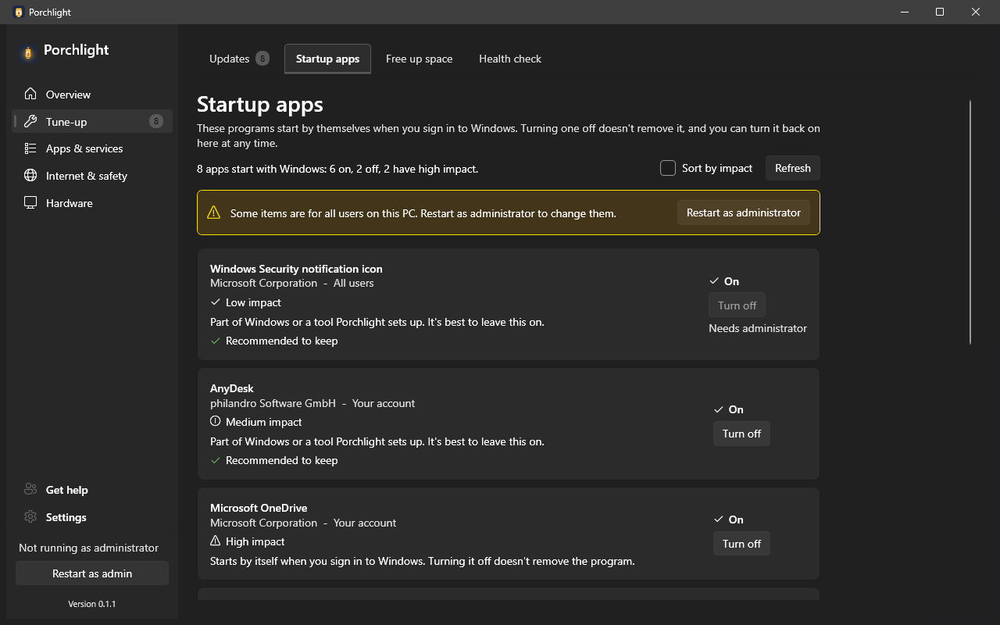

# Startup apps

**Where to find it:** Tune-up > Startup apps.

These are the programs that start by themselves when you sign in to Windows. Too many of them makes a PC slow to start. This page lists them in plain language, shows how much each one slows the start down, and lets you turn each one off (or back on). Turning one off does not uninstall it, and you can turn it back on here at any time.

*(Screenshot uses made-up demo data, not a real PC.)*

## What's on the page

- **Introduction** - a reminder that nothing is removed.
- **Summary line and Refresh** - how many programs start automatically, how many have a high impact, and a button to re-read the list.
- **Sort by impact** - puts the programs that slow the start down most at the top.
- **Impact note** - Windows keeps the startup measurements in a protected folder. When Porchlight isn't running as administrator, every program shows "Not measured" and one line offers **Restart as administrator** to see them.
- **Administrator banner** - shown when Porchlight is not running as administrator. Some startup entries (those that apply to every user of the PC) can only be changed with admin rights; use **Restart as admin** in the left menu.
- **Message / error line** - confirmation after you change something, or a note if a change did not work.
- **Empty state** - "Nothing starts automatically. Your PC should start quickly." when the list is empty.

Porchlight's own "start when I sign in" task is not listed here; use **Settings > General** for it.

## Each program in the list

- **Name**, with the **publisher** and where it comes from: **Your account** (just you), **All users** (everyone who signs in to this PC) or **Scheduled task** (a task in Windows' Task Scheduler that runs when you sign in).
- **Impact** - **High**, **Medium** or **Low impact**, from Windows' own measurements of recent starts, using the same rules as Task Manager: high means more than 1 second of processor time or more than 3 MB read from or written to disk while the PC starts; low means under 0.3 seconds and under 300 KB. **Not measured** means Windows has no data for it (or Porchlight can't read it - see above).
- **A hint** - a short plain-language note about what the program is.
- **Recommended to keep** - a green tick on things Porchlight thinks you should leave on (for example security software).
- **Status** - whether it currently starts with Windows.
- **Turn off / Turn on button** - switches it. It is greyed out when it cannot be changed. For a scheduled task, this turns the task off in Task Scheduler (the same as its Disable option); the task itself is kept.
- **Needs administrator** - shown under the button when changing that entry requires admin rights.

---

[Back to the page list](../../README.md#pages)
